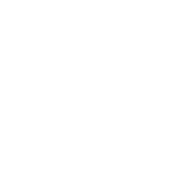
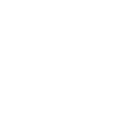

# OuterWildsPlanetIcons
The planet icons from the game Outer Wilds redrawn as .svg

## Content
The following icons are included in this repo.

- Ash Twin
- Attlerock
- Brittle Hollow
  - Brittle Hollow v1 
  - Brittle Hollow v2 
  - Brittle Hollow v3 
- Dark Bramble
- Ember Twin
- Eye Coordinates
- Giant's Deep
  - Giant's Deep v1
  - Giant's Deep v2
- Hollow Lantern
- Hourglass Twins
- Interloper
- Orbital Probe Canon
- Quantum Moon
- Sun Station
	- Sun Station v0
	- Sun Station v1
- The Eye
  -  The Eye
  -  The full Eye
- The Stranger Eye
- Timber Hearth
- White Hole Station

## Disclamer
I did not originially create most of these icons and merely redrew from lower quality reference images i found online or in the game.

The following icons were either directly created by me or are my alterations of previously existing icons.

- Brittle Hollow
  - Britt Hollow v2 
  - Britt Hollow v3 
- Giant's Deep v2
- Orbital Probe Canon
- Sun Station
- The Full Eye

## Licensing
From my side you can do whatever you want with these icons, just pls credit me and don't involve them in any bigotry.
I can't speak for whoever holds the rights to the icons that i did not originally create.

---

## Some Previews

|...|...|...|...|
|---|---|---|---|
|||||
|||||
|||||
|||||
|||||
